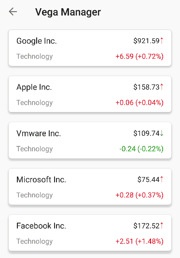
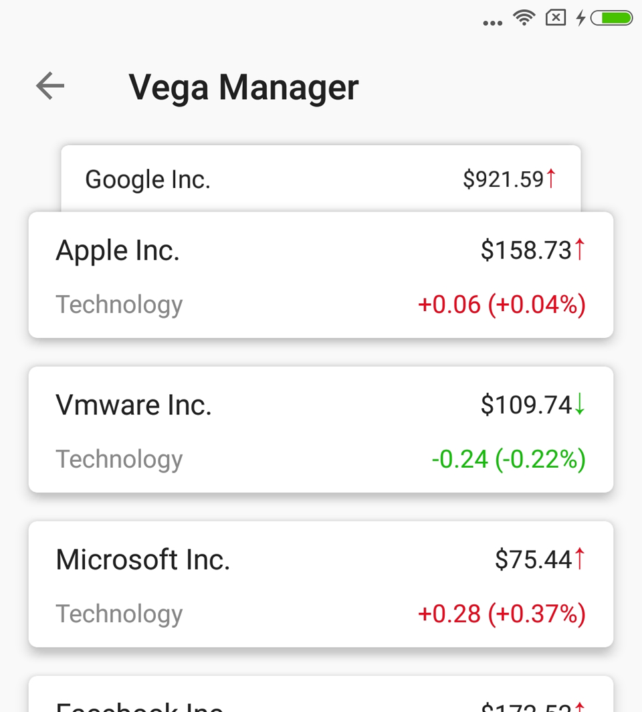

# VegaLayoutManager
a customized LayoutManager - fade and shrink the head itemView when scrolling.

### 实现效果

Dribbble设计：[链接](https://dribbble.com/shots/3793079-iPhone-8-iOS-11)<br>
IOS实现：[VegaScroll](https://github.com/AppliKeySolutions/VegaScroll)

### 代码思路
RecyclerView最顶部的itemView，会随着手指滑动实现收缩隐藏与放大显示，并伴随recycler的回收与复用。<br><br>
代码比较简单粗暴，使用自定义的LayoutManger，内置SnapHelper。<br>
由于想要在任意时刻都能snap到第一个子View，所以在LayoutManager中用了比较讨巧的方法去设定scroll的最大值。

### 使用方法
1. gradle引入
```gradle
compile 'com.stone.vega.library:VegaLayoutManager:1.0.1'
```
2. java文件中设定LayoutManager
```java
recyclerView.setLayoutManager(new VegaLayoutManager());
```

### demo下载
[点击下载](https://github.com/xmuSistone/VegaLayoutManager/blob/master/app-debug.apk?raw=true)


### License

    Copyright 2017, xmuSistone

    Licensed under the Apache License, Version 2.0 (the "License");
    you may not use this file except in compliance with the License.
    You may obtain a copy of the License at

       http://www.apache.org/licenses/LICENSE-2.0

    Unless required by applicable law or agreed to in writing, software
    distributed under the License is distributed on an "AS IS" BASIS,
    WITHOUT WARRANTIES OR CONDITIONS OF ANY KIND, either express or implied.
    See the License for the specific language governing permissions and
    limitations under the License.
    
### 软文
有一个姑娘，她有一些任性！她还有一些嚣张！<br><br>
妹纸开了个店，然后盯上了我github。<br><br>
看在这么靠底的份上，别骂我好么？这真的是一篇软文，不信请扫二维码：<br><br>

